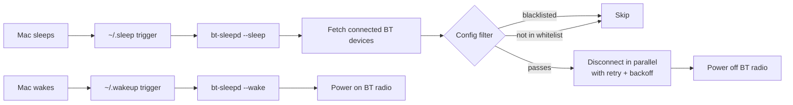
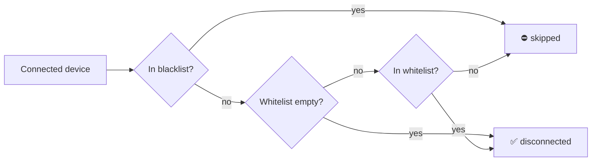

# bt-sleepd

Automatically disconnect Bluetooth devices and power off the Bluetooth radio when your Mac sleeps, then re-enable it on wake. This lets your devices (headphones, keyboards, mice, etc.) reconnect instantly to your phone or other machines instead of being held hostage by a sleeping Mac.

## How it works

[`sleepwatcher`](https://www.bernhard-baehr.de/) watches for macOS sleep/wake notifications and runs the scripts `~/.sleep` and `~/.wakeup`. Those scripts invoke `bt-sleepd` with the appropriate mode:



`sleepwatcher` is a tiny daemon that runs as a `launchd` service, so it survives reboots and logins.

---

## Features

| Feature | What it does |
|---|---|
| **Sleep mode** (`--sleep`) | Lists connected Bluetooth devices, filters them against your config, disconnects each one concurrently with retries, and optionally powers off the radio. |
| **Wake mode** (`--wake`) | Powers the Bluetooth radio back on so your keyboard and mouse reconnect. |
| **Parallel disconnection** | Devices are disconnected concurrently via goroutines — much faster than one-at-a-time when you have multiple devices. |
| **Retry with exponential backoff** | If a `blueutil --disconnect` call fails, it retries (default: 3 attempts) with exponential backoff (1s → 2s → 4s) plus random jitter. |
| **Device filtering** | Configure a **blacklist** (devices to never disconnect) and/or a **whitelist** (only disconnect these). Matching is case-insensitive substring (works on both the device name and the MAC address). |
| **Config file** | JSON config at `~/.config/bt-sleepd/config.json`. Optional — if missing, sensible defaults apply. |
| **Dry-run mode** (`--dry-run`) | Preview which devices would be disconnected and whether Bluetooth would be toggled — without actually doing it. |
| **List devices** (`--list`) | Show all currently connected Bluetooth devices with their names and MAC addresses. |
| **Show config** (`--show-config`) | Print the effective configuration (merged defaults + config file) and exit. |
| **Install command** (`--install`) | Automatically creates `~/.sleep` and `~/.wakeup` with the correct binary path and `PATH` for `launchd`. |
| **Uninstall command** (`--uninstall`) | Removes `~/.sleep` and `~/.wakeup`. |
| **Init config** (`--init-config`) | Writes a starter config file to `~/.config/bt-sleepd/config.json`. |
| **Structured logging** | Timestamped `[HH:MM:SS]` logging to stderr. Errors and warnings are always shown; info-level progress requires `--verbose`. |

---

## Requirements

- macOS
- [Homebrew](https://brew.sh)
- Go (only if building from source)

---

## Installation

### 1. Install dependencies

```sh
brew install blueutil sleepwatcher
```

Also install Go if needed:

```sh
brew install go
```

### 2. Install `bt-sleepd`

**From source:**

```sh
git clone https://github.com/tacheraSasi/bt-sleepd.git
cd bt-sleepd
go build -o bt-sleepd .
```

**With `go install`:**

```sh
go install github.com/tacheraSasi/bt-sleepd@latest
```

### 3. Install the sleep/wake hooks

```sh
# Run from the repo directory (or use the full path to bt-sleepd)
./bt-sleepd --install
```

This creates `~/.sleep` and `~/.wakeup` scripts that invoke `bt-sleepd --sleep` and `bt-sleepd --wake`. The scripts embed the **absolute path of the binary you just ran `--install` with**, with symlinks resolved. This matters if you later move or delete the binary — you'll need to re-run `--install` to refresh the paths.

What the scripts look like after `--install` (example from this repo):

**`~/.sleep`:**
```bash
#!/bin/bash
# Auto-generated by bt-sleepd
PATH=/opt/homebrew/bin:/Users/mac/tach/go/bt-sleepd:/usr/bin:/bin
{
  echo "[$(date)] sleep triggered"
  /Users/mac/tach/go/bt-sleepd/bt-sleepd --sleep
  echo "[$(date)] exit=$?"
} >> /tmp/bt-sleepd.log 2>&1
```

**`~/.wakeup`:**
```bash
#!/bin/bash
# Auto-generated by bt-sleepd
PATH=/opt/homebrew/bin:/usr/bin:/bin
{
  echo "[$(date)] wakeup triggered"
  /Users/mac/tach/go/bt-sleepd/bt-sleepd --wake
  echo "[$(date)] bluetooth re-enabled"
} >> /tmp/bt-sleepd.log 2>&1
```

The `PATH` lines ensure both `blueutil` and `bt-sleepd` are found even under `launchd`'s empty environment. The sleep script includes the `bt-sleepd` directory in `PATH` so the binary can be found (useful if you want the script to resolve the binary via `PATH`), but invokes it by full path regardless. The wake script only needs `blueutil` on the path.

The installer detects both Intel (`/usr/local/bin`) and Apple Silicon (`/opt/homebrew/bin`) Homebrew paths automatically.

### 4. Start sleepwatcher

```sh
brew services start sleepwatcher
```

This installs and loads a `launchd` plist that runs sleepwatcher on every login.

### 5. Test

With a Bluetooth device connected:

```sh
pmset sleepnow
```

Your Mac will sleep and wake immediately. Check the log:

```sh
tail -f /tmp/bt-sleepd.log
```

You should see the device disconnected and Bluetooth powered off, then back on after wake.

---

## Configuration

bt-sleepd reads an optional JSON config file from `~/.config/bt-sleepd/config.json`. Generate one with:

```sh
bt-sleepd --init-config
```

Open and edit it:

```sh
open -a TextEdit ~/.config/bt-sleepd/config.json
```

### Config reference

```json
{
  "blacklist": ["keyboard", "mouse"],
  "whitelist": ["headphones"],
  "power_off_bt": true,
  "retry_count": 3,
  "retry_delay": 1
}
```

| Field | Type | Default | Description |
|---|---|---|---|
| `blacklist` | `[]string` | `[]` | Device address or name **substrings** (case-insensitive) to never disconnect. Useful to keep your keyboard/mouse connected. |
| `whitelist` | `[]string` | `[]` | If non-empty, **only** devices matching an entry are disconnected. When combined with blacklist, the blacklist is checked first. |
| `power_off_bt` | `bool` | `true` | Whether to power off the Bluetooth radio after disconnecting devices during sleep. Set to `false` to leave BT on (for example, if you want AirDrop or Continuity to keep working). |
| `retry_count` | `int` | `3` | Number of disconnection attempts per device before giving up. |
| `retry_delay` | `int` | `1` | Initial delay in seconds between retries. This is doubled each attempt (exponential backoff) with random jitter, capped at 10 seconds. |

### Filtering behaviour



- Blacklist is checked **first** — a device in both lists is skipped.
- Matching is **case-insensitive substring** against both the device name (e.g. `"Magic Keyboard"`) and the colon-formatted address (e.g. `"aa:bb:cc:dd:ee:ff"`).
- An empty blacklist + empty whitelist = no filtering, all devices are disconnected.

---

## CLI reference

| Flag | Default | Description |
|---|---|---|
| `--sleep` | `false` (implied if no mode given) | Run the sleep handler: fetch connected devices, filter them, disconnect concurrently with retries, optionally power off BT. |
| `--wake` | `false` | Run the wake handler: power on the Bluetooth radio. |
| `-dry-run` | `false` | Preview actions without making changes. Prints what would be disconnected and whether BT would be toggled. Exits cleanly. |
| `-verbose` | `false` | Show timestamped info-level progress (device names, retry attempts, etc.). Errors and warnings are always shown. |
| `-config <path>` | `~/.config/bt-sleepd/config.json` | Path to a JSON config file. |
| `--list` | `false` | List all currently connected Bluetooth devices with their names and MAC addresses, then exit. |
| `-show-config` | `false` | Print the effective configuration (defaults merged with file) as JSON, then exit. |
| `--init-config` | `false` | Write a default config file to `~/.config/bt-sleepd/config.json` and exit. |
| `-force` | `false` | Overwrite existing files when used with `--init-config`. |
| `--install` | `false` | Create `~/.sleep` and `~/.wakeup` scripts that invoke bt-sleepd. |
| `--uninstall` | `false` | Remove `~/.sleep` and `~/.wakeup` scripts. |
| `--version` | `false` | Print the version string and exit. |
| `--help` | — | Show the help text. |

If neither `--sleep` nor `--wake` is given, `--sleep` is assumed.

### Exit codes

| Code | Meaning |
|---|---|
| `0` | Success (or dry-run / info command). |
| `1` | Any error (config load failure, blueutil failure, etc.). |

---

## Behavioural details

### Sleep mode (`--sleep`) — step by step

1. **Discover** — calls `blueutil --connected --format json-pretty` and parses the JSON with `encoding/json`.
2. **Filter** — each device is checked against the blacklist, then the whitelist.
3. **Disconnect** — surviving devices are disconnected **concurrently** using goroutines. Each goroutine runs `blueutil --disconnect <address>` and retries on failure.
4. **Retry logic** — up to `retry_count` attempts with exponential backoff (`retry_delay` → ×2 → ×2, capped at 10s) plus random jitter (±50% of the delay) to avoid thundering-herd issues.
5. **Power off** — if `power_off_bt` is `true`, runs `blueutil --power 0`.
6. **Summary** — logs and reports how many succeeded and failed.

### Wake mode (`--wake`) — step by step

1. **Power on** — runs `blueutil --power 1`.
2. macOS re-discovers previously paired devices automatically. They reconnect normally.

### Dry-run mode (`--dry-run`)

Prints what *would* happen without executing any `blueutil` commands. Respects filtering, so you can verify your blacklist/whitelist config before relying on it.

### Verbose logging

With `--verbose`, bt-sleepd prints timestamped info lines like:

```
[14:32:01] Sleep handler started
[14:32:01] Disconnecting 2 device(s)…
[14:32:01]   → disconnect Magic Keyboard (aa:bb:cc:dd:ee:ff) [attempt 1/3]
[14:32:01] ✓ Magic Keyboard (aa:bb:cc:dd:ee:ff) disconnected
[14:32:01]   → disconnect Sony WH-1000XM4 (11:22:33:44:55:66) [attempt 1/3]
[14:32:01]   ✗ attempt 1 failed for 11:22:33:44:55:66; retrying in 1.3s: exit status 1
[14:32:03] ✓ Sony WH-1000XM4 (11:22:33:44:55:66) disconnected
[14:32:03] Disconnected 2/2 device(s).
[14:32:03] Powering off Bluetooth…
[14:32:03] Bluetooth powered off.
[14:32:03] Sleep handler completed.
```

Without `--verbose`, only warnings and errors appear (clean output for the log file by default).

---

## Logs

When installed via `--install`, the `~/.sleep` and `~/.wakeup` scripts capture all output to `/tmp/bt-sleepd.log`:

```sh
tail -f /tmp/bt-sleepd.log
```

If you're running bt-sleepd manually (not through sleepwatcher), output goes to stderr.

---

## Troubleshooting

**"executable file not found in $PATH"** — if you manually created `~/.sleep` / `~/.wakeup` instead of using `--install`, the `PATH` prefix in the script is missing or wrong. Run `which blueutil` and update the path. Better yet, re-run `bt-sleepd --install` to regenerate them correctly.

**Sleepwatcher doesn't fire** — verify it's running:

```sh
ps aux | grep sleepwatcher | grep -v grep
```

If not, restart it:

```sh
brew services restart sleepwatcher
```

**Bluetooth doesn't power off** — on recent macOS, `blueutil` (and any binary that controls Bluetooth) may need to be granted Accessibility / Automation permissions in System Settings → Privacy & Security. Since sleepwatcher runs under `launchd`, you may also need to grant the same to `/usr/local/opt/sleepwatcher/sbin/sleepwatcher` or `/opt/homebrew/opt/sleepwatcher/sbin/sleepwatcher`.

**A device reconnects immediately** — some devices (especially Apple's own like AirPods) aggressively re-pair. bt-sleepd disconnects and powers off the radio, so they shouldn't be able to reconnect until wake. If you see this, make sure `power_off_bt` is `true` in your config.

**Want to keep keyboard/mouse connected but disconnect headphones** — use the blacklist:

```json
{
  "blacklist": ["keyboard", "mouse", "trackpad"]
}
```

---

## Uninstalling

```sh
bt-sleepd --uninstall
brew services stop sleepwatcher
```

Or remove everything manually:

```sh
brew services stop sleepwatcher
rm ~/.sleep ~/.wakeup
rm -rf ~/.config/bt-sleepd
brew uninstall blueutil sleepwatcher
```

---

## License

See [LICENSE](LICENSE).
